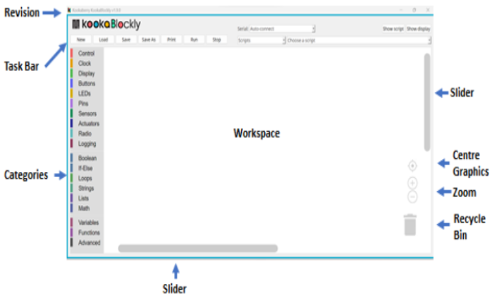
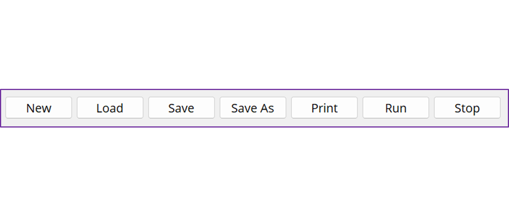
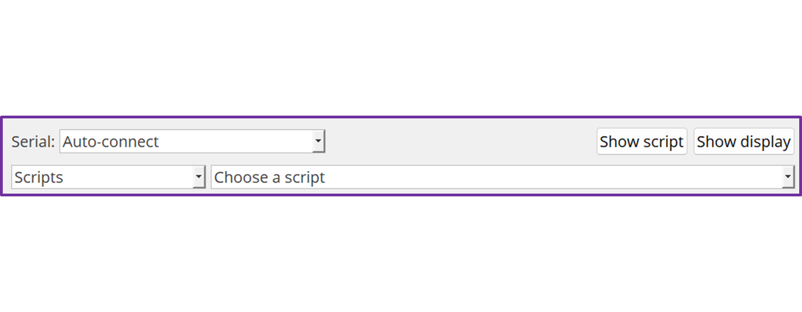

================
**KookaBlockly**
================

A stand-alone graphical visual editor for the Kookaberry
This document provides a quick overview of KookaBlockly.  More detailed information about KookaBlockly 
may be found the KookaBlockly Reference Guide.

Installing KookaBlockly
-----------------------

KookaBlockly runs as a stand-alone program on a Windows 10 or MAC based personal computer.  
The latest version of KookaSuite, which includes KookaBlockly, can be downloaded 
from the Kookaberry Github repository - 
https://github.com/Kookaberry

Introduction
------------

KookaBlockly is a stand-alone graphical, drag and drop, editor for the Kookaberry and related microprocessor 
boards.  It is based upon the open source Google Blockly (Apache 2 license) which is a library from Google 
for building beginner friendly programming languages.  It was written by Damien George 
( George Robotics – MicroPython)  in conjunction with Kookaberry Pty Ltd, the AustSTEM Foundation and 
supported by the Warren Centre and the Vonwiller Foundation.

KookaBlockly allows the creation of syntactically correct scripts and programs even if the user does not 
know any program language.  KookaBlockly converts the assembled graphical blocks into structured MicroPython 
(Python 3.0) code which is then able to be saved, downloaded and / or run on a Kookaberry, Raspberry Pi Pico 
or related RP2040 boards

Working with KookaBlockly allows the user to drag and drop graphical code blocks into a workspace.  
The blocks can be graphically interlocked or snapped together using sockets (socketed) to represent code 
concepts such as program controls (activation, termination, loops and decisions), actions, and result 
computations (variables, values, mathematical and logical expressions).  This graphical process allows 
users to apply programming concepts and principles to designing scripts or programs without having to be 
concerned about the syntax and semantics of MicroPython.

Using KookaBlockly
------------------

**Download KookaSuite** 

Download KookaSuite from the GitHub repository and install on a Windows 10 or 11 PC or on a MAC.

**User Screen Display**

Run KookaBlockly on your computer and the following screen display will be presented.

*Revision Level*    -   The Revision Level of KookaBlockly is shown at the top left-hand side of the display

*Task Bar*          -   The Task bar is divided into two areas.  The first area comprises script command buttons 
                        on the left-hand side of the display.  With the second area comprising, display and script 
                        loading commands on the right-hand side of the display.

                 

