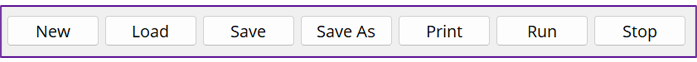
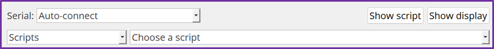
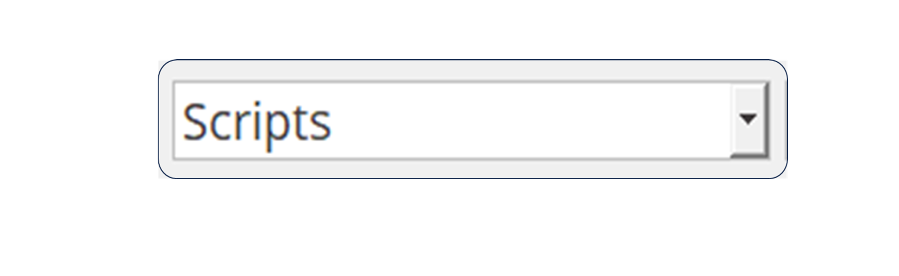

================
**KookaBlockly**
================

A stand-alone graphical visual editor for the Kookaberry
This document provides a quick overview of KookaBlockly.  More detailed information about KookaBlockly 
may be found the KookaBlockly Reference Guide.

Installing KookaBlockly
-----------------------

KookaBlockly runs as a stand-alone program on a Windows 10 or MAC based personal computer.  
The latest version of KookaSuite, which includes KookaBlockly, can be downloaded 
from the Kookaberry Github repository - 
https://github.com/Kookaberry

Introduction
------------

KookaBlockly is a stand-alone graphical, drag and drop, editor for the Kookaberry and related microprocessor 
boards.  It is based upon the open source Google Blockly (Apache 2 license) which is a library from Google 
for building beginner friendly programming languages.  It was written by Damien George 
( George Robotics – MicroPython)  in conjunction with Kookaberry Pty Ltd, the AustSTEM Foundation and 
supported by the Warren Centre and the Vonwiller Foundation.

KookaBlockly allows the creation of syntactically correct scripts and programs even if the user does not 
know any program language.  KookaBlockly converts the assembled graphical blocks into structured MicroPython 
(Python 3.0) code which is then able to be saved, downloaded and / or run on a Kookaberry, Raspberry Pi Pico 
or related RP2040 boards

Working with KookaBlockly allows the user to drag and drop graphical code blocks into a workspace.  
The blocks can be graphically interlocked or snapped together using sockets (socketed) to represent code 
concepts such as program controls (activation, termination, loops and decisions), actions, and result 
computations (variables, values, mathematical and logical expressions).  This graphical process allows 
users to apply programming concepts and principles to designing scripts or programs without having to be 
concerned about the syntax and semantics of MicroPython.

Using KookaBlockly
==================

**Download KookaSuite** 
-----------------------

Download KookaSuite from the GitHub repository and install on a Windows 10 or 11 PC or on a MAC.

**User Screen Display**
-----------------------

Run KookaBlockly on your computer and the following screen display will be presented.

.. image:: images/KB_Init_Display.png
    :alt:  Initial Display
    :width: 640px

*Revision Level*    -   The Revision Level of KookaBlockly is shown at the top left-hand side of the display

*Task Bar*     
            The Task bar is divided into two areas.  The first area comprises script command buttons 
            on the left-hand side of the display.  With the second area comprising, display and script 
            loading commands on the right-hand side of the display.

            With the second area comprising, display and script loading commands on the right-hand side of the display.

                 
            

The individual button controls are described in the following paragraphs

**New** button 

This button starts a new script and any script on the display will be cleared. Move the cursor 
to this button, press click on the mouse and the following will be displayed.

.. image:: images/Start_New_Pgm.png
    :width: 300
    :height: 150
    :align: center
    :alt: Start New Program ?

Press **Yes** to start a new script / program or **No** to revert.  Caution - this will erase the current workspace and any 
work not saved will be lost.  Please be careful to save any work that is to be retained.

**Load** button

This button allows the user to select a KookaBlockly program to be loaded into the Workspace.  Move the cursor to this 
button, press click on the mouse and the following file dialogue will be displayed:

The default directory within the current user’s account is /KookaberryScripts/KookaBlockly and the user can navigate away 
from this as desired.  Selecting a script and pressing the **Open** button, or alternatively double-clicking on a selected 
KookaBlockly script will place a copy of that script in the KookaBlockly Workspace from where it can be modified, saved 
and run on the Kookaberry.

If the workspace is not empty, and new KookaBlockly script is loaded, it will be added to the current workspace.  This is 
useful where frequently used snippets of KookaBlockly are stored away in their own script files for reuse in other scripts.

**Save** button

This button allows a user to save a script that is in the Workspace.  Move the cursor to this button, press click on the 
mouse and the following will be displayed:

The default directory is  /KookaberryScripts/KookaBlockly within the current user’s account and the user may navigate 
away from this as desired.  After typing in a name for the script, or clicking on a pre-existing script to be overwritten, 
then pressing Save the KookaBlockly script will be saved in the selected directory.  Note:  In saving a KookaBlockly script 
KookaBlockly will add a .kby to the file identify the file as one that can be loaded onto KookaBlockly.  A typical file name 
could then be say test.kby.py

**Print** button

This button allows a user to print a script that is in the current Workspace.  Move the cursor to this button, press 
click on the mouse and the following will be displayed.

A printer may now be selected and the script printed.
Note - only the visible area of the workspace will be printed.  Zoom the view of the KookaBlockly script in or out to 
size it appropriately for printing.  The Print dialogue provides a preview of the page to be printed.

**Run** button

This button allows a user to run a script that is in the current Workspace on the attached Kookaberry.  Move the cursor 
to this button, ensure that a Kookaberry is connected via the USB port, press click on the mouse and the script will 
be sent to the Kookaberry and run.

**Stop** button

This button allows a user to Stop a script that is currently running on the Kookaberry.  Move the cursor to this button, 
press click on the mouse and the currently running script on the Kookaberry will stop.

**Serial** pane and drop down list

This display shows whether a Kookaberry is connected to the USB port of the computer and the serial port being used.  
“Auto-connect” shows that the PC / KookaBlockly is waiting for a Kookaberry to be connected to the USB port.  When a 
Kookaberry is connected the Serial: will show the com: port connection such as Kookaberry on \\.\COM8.  The com: port 
selected will be automatically selected via the operating system of your computer.
If, on rare occasions, the Kookaberry becomes unresponsive, click on the drop-down list and select the Auto-connect 
option to cause the connection to be renewed.

**Scripts** pane and drop down lists

Press the down arrow in the Scripts pane and select from the available folders. Scripts is the default folder and 
users may create additional folders.

The pane to the right of the Scripts folder selection gives access to available scripts

Pressing the down arrow shows the available scripts that may be downloaded to the KookaBlockly Workspace.  Moving the 
cursor over the desired script and clicking will load the selected KookaBlockly script to the KookaBlockly workspace.  
The loaded KookaBlockly script will replace the contents of the current Workspace.  Please ensure that any unsaved work is 
saved prior to using the Scripts list to load.  This behaviour differs from using the Load button where the KookaBlockly 
is added to the current workspace.

**Show Script** button

This button allows a user to display the MicroPython script generated from the graphical script that is in the KookaBlockly 
workspace.  Move the cursor to this button and press click on the mouse and the MicroPython script will be displayed.  
The size of the display pane showing the script can be adjusted by clicking on and dragging the edges of the script window 
using the cursor.

**Show Display** button

This button allows the user to show what is being displayed on the attached Kookaberry’s display in a small pane on the 
computer’s display.  Move the cursor to this button, press click on the mouse and the display will appear on the computer 
in a separate window.  The size of this window can be adjusted by the user by clicking on and dragging the window edges 
using the cursor.

Buttons A, B, C and D replicate the buttons on the Kookaberry and may be used on the Display to in a similar manner to 
the Kookaberry.

The Kookaberry Reset button performs a software reset to the Kookaberry.

The Kookaberry Menu displays the internal Kookaberry menu

*Workspace*

The Workspace is the area where the graphical blocks are dragged and dropped to.  A MicroPython script is automatically 
generated from the graphical blocks in the Workspace.

*Sliders*

Sliders are on the bottom and the right-hand side of the KookaBlockly display and can be used with the mouse to reposition 
the blocks on the KookaBlockly display. An alternative method is to click the cursor on a blank area in the workspace 
and drag it until the script is conveniently positioned.

*Icons* located on bottom right of the workspace

This icon centres the graphical display that is in the current workspace.  
Hover the cursor over the icon and click the mouse.  The workspace graphical blocks will be centred.

.. image:: images/Zoom_Icon.png
    :width: 50
    :height: 70
    :align: center
    :alt: Zoom icon

This icon allows the user to zoom in or out on graphical blocks.  It can be used in conjunction with the sliders to 
position blocks in the workspace.  Alternatively use the wheel on the mouse to zoom in and out.

.. image:: images/Recycle_Icon.png
    :width: 80
    :height: 80
    :align: center
    :alt: Recycle Bin icon

This is the Recycle Bin icon.  KookaBlockly blocks can be dragged and dropped 	into the bin 	to delete them.  
Blocks remain in and can be retrieved from the Recycle Bin by dragging 	until KookaBlockly is closed.

**Categories**

There are a number of **Categories** of blocks located on the left hand side of the KookaBlockly workspace.  These Categories contain 
**blocks** that can be selected and placed in the Workspace.

A **Category** can be selected by placing the cursor over the Category and making a single click.
Some categories contain standard Blockly blocks whilst others contain blocks specific to the Kookaberry

The *Categories** may be summarised as follows:

